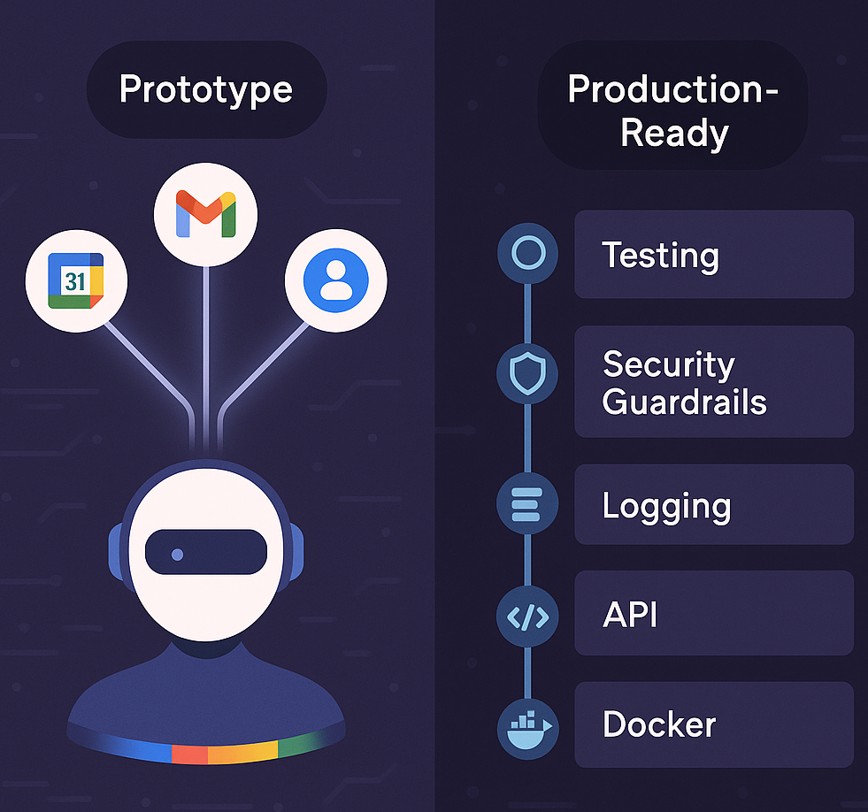

# Google Workspace Agent: From Prototype to Real-World Readiness 🚀

Agentic AI systems only prove their value when they can run reliably outside the lab. A prototype demonstrates potential, but production use demands **robustness, safety, usability, and resilience**. It’s the difference between “showing what’s possible” and “making it dependable every day.”

Our **Google Workspace Agent** began as a prototype that connected Gmail, Calendar, and Contacts through natural language requests using **LangGraph’s orchestration**. This update goes beyond that foundation, focusing on how we hardened the system with **testing, security guardrails, logging, a secure API, an interactive UI, resilience features, and Docker deployment**, bringing it closer to real-world readiness.



***

## Quick Recap: What the Previous Publication Covered 🧭

In the previos article: [ Google Workspace Agent: Your AI Assistant for Seamless Workspace Management 🤖🚀](https://app.readytensor.ai/publications/google-workspace-agent-your-ai-assistant-for-seamless-workspace-management-uwfwUCXBN3E2), we explored the distinction between **workflows** and **agents**, showing when predictable automations suffice and when adaptive intelligence is needed. To illustrate this shift, we introduced the **Google Workspace Agent**, capable of coordinating Gmail, Calendar, and Contacts through natural language interaction.

The architecture relied on a **multi-agent system powered by LangGraph**, where the **Orchestrator** planned tasks and delegated them to specialized **Managers** (for calendar, email, contacts, and date resolution). These managers acted as intelligent routers, while lightweight **ReAct workers** executed domain-specific actions. Together, they enabled features like **multi-step automation**, **context awareness**, **memory across conversations**, and **multi-account support**.

That first publication concluded with a **hands on demo**: running the Orchestrator from a Jupyter notebook to create events, draft emails, and retrieve contacts, showing the agent in action as a working prototype. This new update builds on that foundation, shifting the focus toward production readiness and real-world deployment.

***

## What’s New Since the Prototype ✨

Since releasing the prototype, we focused on turning the Google Workspace Agent into a production-ready system by adding features that strengthen reliability, safety, and usability.

One of the most important updates is the **Search Manager**, which was straightforward to integrate thanks to the modular architecture we designed from the start. This new component brings grounding to user questions that involve general knowledge, reducing the chances of hallucinations and improving the agent’s ability to provide meaningful, well-informed answers.

Beyond that, we introduced **comprehensive logging** across entry and exit points, checkpoints, and error traces to give full visibility into agent behavior. We also built a **secure API layer with FastAPI and API Key authentication**, exposing endt, history, and account management. The `/chat` endpoint now leverages **Server-Sent Events (SSE)** to stream reasoning steps in real time, letting users literally “see the agent think.”

On the testing side, we expanded coverage with **pytest**, adding unit and integration tests that validate tools, input handling, Google API calls, and API endpoints. To enhance safety, we integrated **guardrails-ai**, filtering inputs before they reach the Orchestrator to prevent prompt injection or policy violations.

Finally, we created a **Streamlit interface** on top of the API to provide a simple but effective chat panel, and we **containerized the system with Docker** to ensure consistent deployment across environments.

In the sections that follow, we’ll explore these new components in more depth, showing how each contributes to making the agent not just functional, but truly ready for real-world use.

***

## Toolset 🛠️

To bring the Google Workspace Agent closer to real-world readiness, we built the system on a carefully chosen stack of technologies. Each component plays a distinct role in reasoning, orchestration, persistence, or interface, while keeping the architecture modular and maintainable. This separation of concerns allows us to extend functionality, integrate new managers, and scale with minimal friction.

### ⚙️ Tech Stack

| Component           | Tool / Service                                                             | Purpose                                                                                                                                   |
| ------------------- | -------------------------------------------------------------------------- | ---------------------------------------------------------------------------------------------------------------------------------------- |
| **LLM Provider**             | [OpenAI](https://openai.com/)                                              | The **core brain of the system**, handling natural language understanding, reasoning, and step-by-step planning with consistent outputs. |
| **Agentic Framework** | [LangGraph](https://www.langchain.com/langgraph)                           | Provides a **graph-based orchestration layer** for managing multi-agent workflows, state propagation, and complex execution plans.       |
| **LLM Integration** | [LangChain](https://www.langchain.com/langchain)                           | Supplies the **foundation for tool creation and prompt management**, seamlessly integrating with LangGraph and LangSmith.                |
| **Model Tracking**  | [LangSmith](https://smith.langchain.com/)                                  | Enables **monitoring, debugging, and evaluation** of every reasoning step and tool call with a visual trace of agent behavior.           |
| **Persistence**        | [PostgreSQL](https://www.postgresql.org/) / [SQLite](https://sqlite.org/)                         | Stores **conversation history, checkpoints, and credentials**, ensuring persistence across sessions and reliable recovery.               |
| **API Integration** | [Google Auth/API Client](https://developers.google.com/api-client-library) | Provides secure **access to Gmail, Calendar, and Contacts**, handling authentication flows and token refresh automatically.              |
| **Authentication**  | [Google Auth](https://developers.google.com/api-client-library)            | Manages **OAuth2 credentials, consent flows, and multi-account associations** for seamless user login and account linking.               |
| **Testing Suite**   | [Pytest](https://docs.pytest.org/en/stable/)                                                                     | Validates the system with **unit, integration, and end-to-end tests**, ensuring reliability across tools, APIs, and workflows.           |
| **API Layer**       | [FastAPI](https://fastapi.tiangolo.com/)                                                                    | Exposes system capabilities through a **secure REST API** with API Key authentication and **SSE-powered streaming chat**.                |
| **User Interface**  | [Streamlit](http://docs.streamlit.io/)                                                                  | Provides a **conversational UI** built on the API, allowing users to interact with the agent in a simple, intuitive panel.               |
| **Environment**     | [Poetry](https://python-poetry.org/docs/)                                                                     | Ensures **dependency management, reproducibility, and virtual environments**, simplifying setup and deployment pipelines.                |

***

## Logging & Traceability 📜

The first step toward making our system production-ready was to ensure visibility into what is happening at every moment inside the system. This is not about monitoring the LLM itself, but about tracking the flow of execution across our own components, so that we always know what the system is doing, where it might fail, and how it behaves under different conditions. Logging, in this sense, is the backbone of reliability, debugging, and operational trust.

To achieve this, we built a **centralized logging component** implemented as a **singleton**, ensuring consistent behavior throughout the codebase. Each log entry is tagged with the module name, which allows us to immediately identify the origin of any event. This logger is systematically used across all modules, classes, and functions.

Our logs capture **entry and exit points** of orchestrators, managers, and tools, along with **critical checkpoints** such as API calls, credential handling, token refreshes, and inter-manager coordination. They also document **unexpected behaviors** like exceptions, guardrail blocks, timeouts, retries, and fallbacks. With this structured approach, every interaction leaves a transparent trace that can be followed end to end.

By logging both normal operations and anomalies, we can reconstruct full execution flows, diagnose errors, analyze performance bottlenecks, and provide clear evidence of system behavior at any point in time. This continuous visibility is what allows us to move confidently from prototype to production, knowing the system is not a black box but a transparent, traceable process.

***

## Testing & Validation 🔍

Ensuring production readiness required a **multi-layer testing strategy** that covered everything from deterministic unit tests to human-in-the-loop evaluations. Our goal was to validate not only that each component behaves correctly in isolation, but also that the system as a whole responds safely and reliably under real-world conditions.

### Unit Tests for Deterministic Components

We created extensive **unit tests** to validate the core building blocks of the system, using fakes for external APIs to ensure consistency while still covering edge cases. Key areas included:

* **ReAct Tools** (Calendar, Email, Contacts): Verified both happy paths and error cases such as missing authentication, malformed parameters, and conflict detection.

* **Prompt Builder Module**: Ensured structured templates were correctly generated with variables, roles, context, and reasoning strategies.

* **Google Service Layer** (`google_service package`): Validated handling of user credentials, token refresh, and persistence in the database, guaranteeing correctness of credential storage and retrieval.

* **Graph & Checkpointer**: Confirmed the construction of the orchestration graph and checkpointing mechanisms to preserve state across sessions.

* **API Endpoints**: Tested the FastAPI layer, including `/chat`, `/history`, and account management endpoints, with particular focus on the **chat endpoint using SSE**, ensuring events stream correctly step by step.

* **Edge Cases**: Covered users without Google accounts, revoked access tokens, and malformed requests, confirming the system provides clear and user-friendly error messages in each case.

Together, these tests ensure that deterministic components behave consistently and handle unexpected conditions gracefully.

### Integration Tests with Real LLM Calls

We complemented deterministic unit tests with **integration tests involving real LLM calls**, allowing us to validate reasoning and multi-agent coordination under more complex scenarios. These tests focused on:

* **Malformed and Toxic Inputs**: Ensured the agent responds safely to adversarial prompts, inappropriate queries, or nonsensical inputs.
* **Orchestration Planning**: Verified that the Orchestrator generates the correct step-by-step execution plan for managers, respecting logical dependencies (e.g., resolving dates before checking calendars).
* **Memory Management**: Validated persistence and trimming of conversational context, ensuring continuity across interactions without exceeding limits.
* **ReAct Workers**: For each worker (Calendar, Email, Contacts), tested tool selection and correct invocation sequences, using controlled fake tool outputs to simulate real-world responses.

These tests provided confidence that the system could adaptively reason, route tasks, and coordinate managers under dynamic conditions.

### Human-in-the-Loop Evaluation

Some behaviors are too nuanced to be validated reliably with automated tests. For this reason, we included **human judge evaluations** using Jupyter notebooks in `src/evaluation_notebooks`. These notebooks simulate a wide variety of user scenarios and allow human reviewers to assess the quality of system responses.

* **Complex Multi-Manager Flows**: Assessed correctness in scenarios where multiple managers must work together, such as combining calendar availability with contact retrieval and email drafting.
* **Ambiguity Handling**: Validated the Verifier step when disambiguating contacts, clarifying vague instructions, or resolving incomplete information.
* **Error Recovery**: Checked that the system provides transparent feedback and fallback behavior when data is missing, access is revoked, or external APIs fail.
* **Safety & Security**: Evaluated responses to malicious prompts, policy violations, or unsafe requests, confirming that guardrails prevent harmful outputs.

By combining deterministic testing, integration validation, and human judgment, we ensure that the system is not only **functionally correct**, but also **safe, resilient, and aligned with user expectations**.

***

## Safety & Content Controls 🛡️

A critical requirement for production readiness is ensuring that the system behaves safely, consistently, and in line with clear usage policies. For our agent, this meant implementing **guardrails, sanitization, and strict output controls** that prevent misuse and protect both the user and the system.

We integrated **validators from the [guardrails-ai hub](https://hub.guardrailsai.com/)** to detect and reject **prompt injection attempts** or **unusual prompts** that could manipulate the agent’s behavior. In addition, another validator filters out requests that fall into sensitive categories that we explicitly prohibit:

* No planning of criminal activities.
* No encouragement of self-harm or suicide.
* No promotion of firearms or illegal weapons.
* No promotion of illegal drugs.
* No generation of sexually explicit content.
* No incitement of violence or hate.

If a request is rejected under one of these rules, it is **never recorded in the agent’s memory**. Instead, the user receives immediate and clear feedback explaining why their request cannot be processed.

Importantly, our system does not risk exposing sensitive information such as **Google credentials, API keys, or environment secrets**. The agent simply does not have access to such data, which removes a major vector of concern when thinking about data leakage.

When interacting with **external sources** (e.g., Google Contacts, Gmail, Calendar, or web search), we avoid leaving extraction decisions to the LLM. Each manager enforces **fixed limits**, for instance, a set maximum number of contacts, events, or emails retrieved. For emails specifically, we also **clean responses** to strip away signatures, headers, or unnecessary metadata, ensuring only essential content enters the LLM’s context window.

As noted in the testing section, we included **unit tests** covering toxic, malformed, or adversarial prompts. These tests confirm that the agent consistently produces **polite, professional, and safe responses**, even when faced with hostile or nonsensical input.

Finally, because this system is designed to be used as a **personal assistant in production**, where usage could be tied to cost-per-request or daily quotas, we focused primarily on **preventing harmful misuse** rather than limiting how a legitimate user might overuse the system. Abuse-prevention models can be introduced later at the business layer, but for now our priority is ensuring that every accepted request is processed safely and responsibly.

***

## Observability & Resilience ⚙️

In traditional systems, logs are often enough to trace what went wrong: you have a record of inputs, outputs, and error stacks. But in **agentic systems**, this level of visibility is no longer sufficient. It’s not just about knowing *that* a request failed, we need to understand *how* the agent reasoned step by step, what prompts were generated, which tools were invoked, how the state evolved, and where things started to drift off course.

For this reason, we integrated **LangSmith**, which offers a seamless fit with the **LangGraph** and **LangChain** ecosystem. Beyond its tight integration, LangSmith provides a **web-based interface** that makes the inner workings of the agent transparent:

* You can replay executions (reruns) to validate hypotheses about failures.
* You can inspect prompt inputs/outputs at each orchestration step.
* You can monitor latency, token usage, error rates, tool usage, and more.
* Most importantly, you can observe how the agent’s **state (memory)** evolves in real time.

This fine-grained visibility allows us to pinpoint exactly where things started to go wrong and why. Even the best evaluation setups cannot catch every failure mode; some only appear in production. That’s why **observability is a first-class concern** in our design. Over time, production signals like edge-case queries, fallback triggers, escalation rates, or even explicit user feedback become invaluable for improving alignment and reliability.

### Building for Resilience

Observability alone is not enough. Our system orchestrates **a large number of tools**, and each tool introduces potential points of failure. To make the system truly robust, every external API call is wrapped in a protective function that enforces multiple layers of resilience:

* **Rate & Call Limiting (`max_calls`)**: prevents tools from running indefinitely, protects against infinite loops or abusive usage, and ensures graceful degradation when limits are reached.

* **Repetition Detection (`last_k_elements_equal`)**: identifies repetitive tool calls that signal faulty or adversarial behavior, and stops them before they consume resources unnecessarily.

* **Controlled Retries (`retries`)**: automatically retries failed calls, increasing the likelihood of success when facing transient errors such as network instability or temporary API rate limits.

* **Exponential Backoff with Jitter (`backoff_base`, `backoff_max`)**: spreads out retries over time (1s, 2s, 4s, 8s…), adds randomness to avoid synchronization, and reduces the risk of overwhelming external services (thundering herd problem).

* **Graceful Degradation**: when retries are exhausted or limits are hit, the system responds with **clear fallback messages** instead of breaking the entire flow. The agent continues operating with reduced functionality rather than failing completely.

* **Structured Logging**: every tool call is logged with context, including errors, warnings, retries, and parameters. This structured trail supports observability and enables more intelligent decisions about when to stop, escalate, or adapt behavior.

By combining **deep observability** (via LangSmith) with **layered resilience** in tool orchestration, the agent becomes both **transparent and fault-tolerant**. It can handle real-world variability without collapsing under unexpected conditions, giving developers the necessary visibility to improve its reliability continuously.

***

## API Layer 🔑

One of the most important steps in moving from prototype to production was exposing the system through a **dedicated API**. This makes the agent accessible not only to developers and applications, but also to user interfaces and third-party integrations. An API transforms the agent from an isolated prototype into a service that can be consumed securely and consistently in different contexts.

We chose **FastAPI** as the backbone for this layer because it strikes the right balance between **lightweight performance** and **enterprise-grade capabilities**. It is modern, efficient, and asynchronous by design, making it well suited for handling multiple user requests in parallel. At the same time, it comes with built-in support for dependency injection, validation, and documentation, which allows us to maintain a clear and reliable contract between the backend and any clients that consume the service. In practice, this means we can evolve and extend the system without breaking existing integrations.

The API exposes several endpoints, each designed to cover a specific aspect of the user’s interaction with the agent:

* **User Management** (`/user`): Create a user, retrieve user information, or manage their associated Google accounts. This ensures that each interaction is linked to a specific identity and context.

* **Account Association** (`/user/associate_account` and `/user/dissociate_account`): Allow users to securely link or unlink their Google accounts, making it possible to switch between work, personal, or multiple accounts seamlessly.

* **Conversation History** (`/chat/history`): Retrieve the state of past interactions, so the user and the agent can maintain continuity across sessions.

* **Chat Endpoint** (`/chat`): The heart of the API, enabling live conversations with the agent.

A key feature of the chat endpoint is its use of **SSE**. Instead of working like a traditional system, where a user sends a request and waits silently until the final response arrives, the SSE implementation streams updates in real time. The user sees **progress events** as the agent analyzes the request, calls external tools, and synthesizes an answer, followed by **content events** that gradually build the assistant’s reply. If an error occurs, it is streamed back immediately. This design delivers a far more engaging and transparent user experience, since people can follow the agent’s reasoning step by step rather than waiting in the dark.

From the backend perspective, SSE also represents a major improvement. It prevents the API from being a simple “input → output” black box by exposing the **internal state transitions** of the Orchestrator in a structured way. This not only improves usability but also makes debugging and monitoring significantly easier.

Security is enforced through **API Key** authentication, where keys are generated exclusively by system administrators. This ensures that only authorized clients can access the API, preventing unauthorized individuals from reaching the system.

By providing this API layer, the Google Workspace Agent evolves from an experiment into a **production-ready service**: modular, secure, and capable of powering both direct user interfaces and broader integrations.

***

## User Interface 💻

Just as the API layer transforms the agent into a production-ready service, the **user interface** makes it accessible and enjoyable to use. A system that remains purely backend, even if robust, would feel incomplete without a simple and intuitive way for people to interact with it. The UI is where the power of the agent becomes tangible: users can communicate in natural language, switch contexts, and see the agent’s reasoning unfold in real time.

We chose **Streamlit** as the framework for building this interface. Streamlit aligns perfectly with our goals: it is lightweight, fast to develop with, and optimized for interactive applications. Unlike heavier web frameworks, Streamlit lets us focus on user experience rather than low-level UI plumbing. Its reactive design and Python-native workflows make it a natural fit for prototyping and production alike, allowing us to bridge the gap between **complex backend orchestration** and **human-centered usability**.

The interface provides several key features designed to abstract technical complexity while enhancing usability:

* **Chat Panel with Live SSE Streaming**: at the interface's core a real-time chat panel powered by **SSE**. Instead of waiting for a static response, users see the agent’s **“thoughts” and reasoning steps** streamed progressively. This gives visibility into how the agent is processing requests and makes interactions feel dynamic, transparent, and engaging.

* **Guided Error Handling**: when the agent needs clarification, such as when the **Verifier** detects ambiguity, the UI surfaces inline guidance and clear error messages. Instead of cryptic backend errors, users are offered actionable next steps, making retries or clarifications effortless.

* **Abstracted Technical Complexity**: the design principle behind the interface is to **hide complexity without losing transparency**. Users do not need to worry about API keys, tokens, or orchestration logic; the UI handles these in the background, while still making visible the reasoning process that matters for trust and usability.

Together, these features turn the Streamlit app into more than just a demo client: it is a **practical, human-friendly interface** that lowers barriers to adoption and encourages exploration of the agent’s capabilities.

### Using the Streamlit App

Interacting with the agent through the Streamlit app follows a natural, guided flow:

1. **Login with API Key**: users begin by logging into the application with their username and API key. This establishes a secure connection with the backend services and ensures that only authorized individuals can access the system. To obtain a valid API key, users must **contact the system administrators**, who are responsible for generating and distributing credentials. Additionally, while the Google Cloud project remains unverified, only **pre-registered accounts** explicitly added through the Google Cloud Console are allowed to log in. This safeguard ensures that access stays restricted to approved users during the early stages of deployment.

2. **Associate a Google Account**: once logged in, the next step is to link a Google account. The application uses OAuth credentials stored securely in environment variables, allowing the backend to refresh tokens automatically. Associating an account is required before starting a conversation, ensuring that all interactions are tied to the correct identity and context.

3. **Chat Operations**
   With an account linked, users can access the core functionality of the agent through the chat panel. From here, they can schedule meetings, manage contacts, retrieve conversation history, or perform searches, all through natural language.

4. **Dissociate an Account**
   If a user no longer wishes to keep an account linked, they can easily dissociate it. This provides flexibility and ensures that switching between personal and work contexts remains seamless.

5. **Access Chat History**
   Every interaction is stored and can be revisited through the chat history panel. Each session has a unique identifier, making it simple to retrieve and continue past conversations whenever needed.

### Demo

For a quick demonstration of the interface in action, check out the screen recording [here](https://github.com/MAQuesada/Google-Workspace-Agent/blob/publication/publication/screen-record.mp4).

***

## Deployment with Docker 🐳

Deployment is the final and most crucial step to take our agent from prototype to production. By containerizing every component of the system, we ensure reliability, consistency, and ease of reproduction across environments. A fully Dockerized setup eliminates the classic *“works on my machine”* problem and allows both developers and non-technical users to spin up the entire stack with just a few commands.

### System Requirements

One of the key advantages of our design is that the agent has **minimal hardware requirements**. The heavy lifting, language model inference, and external tool execution are delegated to APIs. This means that running the system locally or in the cloud does not require GPUs or large-scale infrastructure. The only dependencies are:

* **Python libraries**: installed automatically inside the Docker containers.
* **PostgreSQL**: used to store checkpoints and maintain agent memory across users and sessions (also managed by Docker).
* **Docker Engine**: installed on the host machine or cloud service.

With this setup, any computer or cloud instance capable of running Docker can host the system. Whether on a developer laptop, a small VM, or a container cluster, the environment remains identical and easy to reproduce.

### Core Components

* **PostgreSQL Database**: stores persistent checkpoints that allow the agent to maintain memory across sessions and users.

* **Backend API**: provides the orchestration and intelligence layer mentioned before, exposing endpoints to interact with the agent.

* **Web UI**: a lightweight client interface that lets end users easily interact with the agent without needing technical expertise.

This ensures consistency across development, staging, and production by providing identical environments. It offers isolation by encapsulating dependencies within containers, eliminating conflicts with local setups. The deployment gains portability, running seamlessly on cloud providers, on-premises infrastructure, or local machines wherever Docker is supported. Finally, it enables scalability, integrating smoothly with container orchestrators like Kubernetes or ECS to handle production workloads efficiently.

### Quick Start

1. **Clone the repository** and navigate into the project directory:

   ```bash
   git clone https://github.com/MAQuesada/Google-Workspace-Agent.git
   cd google_workspace_agent
   ```

2. **Configure environment variables** in a `.env` file (sample provided as `.env.example`).

3. **Build and start the containers** using Docker Compose:

   ```bash
   docker compose up --build -d
   ```

   * `--build` ensures images are rebuilt if you make changes.
   * `-d` runs containers in detached mode (in the background).

4. **Verify running containers**:

   ```bash
   docker ps
   ```

5. **Stop the containers** when no longer needed:

   ```bash
   docker compose down
   ```

By combining a **minimal set of requirements** with full containerization, our agent is straightforward to deploy and operate. Developers, researchers, and organizations can focus on **building with the agent**, rather than spending time wrestling with environment setup or infrastructure concerns.

***

## Observations & Limitations 📉

**Strengths**

* Unified natural-language access to Gmail/Calendar/Contacts with **transparent** streaming UX.
* **Security posture**: API Keys, OAuth, pre-processing guardrails, and output shaping.
* **Modularity**: Managers/Tools are composable; Search Manager improves grounding.

**Current Limits**

* **OAuth Onboarding**: Initial setup still technical for non-engineers.
* **Service Coverage**: Drive/Docs/Meet not yet supported.
* **UI**: Streamlit is pragmatic but not yet a polished, product-grade frontend.
* **Monitoring**: Logging is in place, but we lack metrics that can trigger red flags when the system deviates from expected behavior.
* **Risks**: The main risk is not credential leakage but prompt injection via dynamic content (emails, events, web results).

***

## Future Enhancements & Directions 🔬

* **Broaden Google Integrations**: Drive, Docs, Sheets, and Meet.
* **Automated Monitoring/Evaluation**: Scenario suites with LangSmith + custom metrics for regressions.
* **Multi-modal**: Voice and visual context; attachment understanding.
* **Productization**: Deploy the service on a cloud provider for reliable hosting and scalability.

***

## Contact & Contribution 📬

* 🐙 **GitHub**: [Google-Workspace-Agent](https://github.com/MAQuesada/Google-Workspace-Agent)
* 📧 **Email**: <malejandroquesada@gmail.com>, <utkarsh251096@gmail.com>
* **Issues/PRs**: Feedback, bugs, and contributions welcome!
